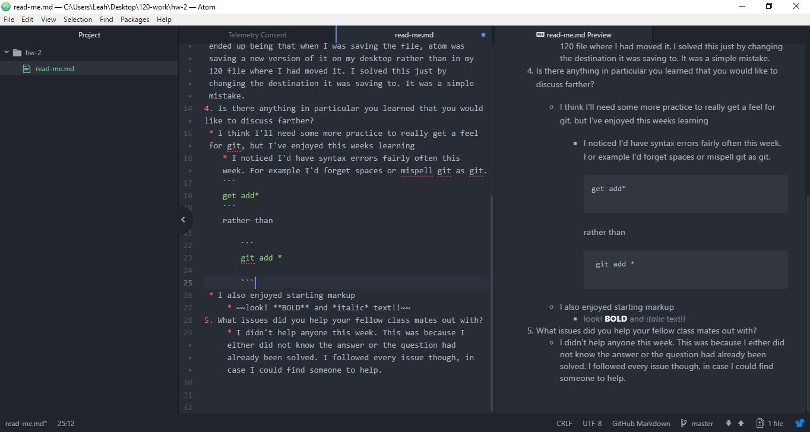

# Markup for Week Two

1. Summarize the work you did this homework cycle
 * This week I worked through the material
provided on the course website. I unfortunately started on Monday, but spent the last three days applying myself to the material.
2. What steps did you take to complete the assignment?
  * As, stated in the previous answer I worked through the material provided
  * I spent time using Git through Powershell and the Github desktop app
  * I worked through any issues I ran into, although they were few and fairly simple
3. Did you have any problems or issues?
 * The only problem I ran into was when I started practicing the Git commands in powershell. I noticed that when I made changes to my Test file, Git wasn't tracking them. The issue ended up being that when I was saving the file, atom was saving a new version of it on my desktop rather than in my 120 file where I had moved it. I solved this just by changing the destination it was saving to. It was a simple mistake.
4. Is there anything in particular you learned that you would like to discuss farther?
 * I think I'll need some more practice to really get a feel for git, but I've enjoyed this weeks learning
    * I noticed I'd have syntax errors fairly often this week. For example I'd forget spaces or mispell git as git.
    ```
    get add*
    ```
    rather than

        ```
        git add *

        ```
 * I also enjoyed starting markup
     * ~~look! **BOLD** and *italic* text!!~~
5. What issues did you help your fellow class mates out with?
     * I didn't help anyone this week. This was because I either did not know the answer or the question had already been solved. I followed every issue though, in case I could find someone to help, and I commented on an issue that was relatable   

## Here's a screenshot of my Markup



### also here's a link to an amazing video
[this guy can juggle and solve Rubiks cubes at the same time](https://www.youtube.com/watch?v=kF9WbaJ0GZ4)
