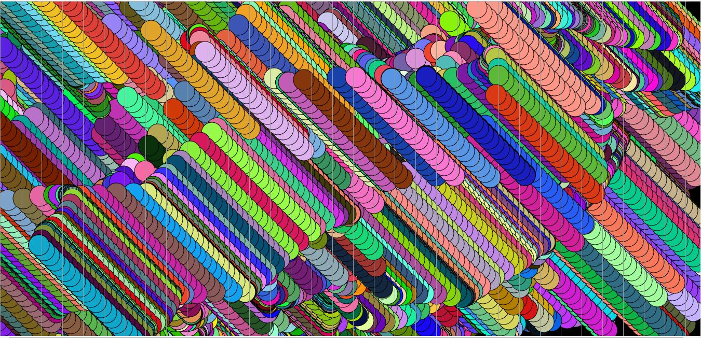

# Mark down of week 5!

## This homework cycle
This was a super fun week! I loved getting into the animation and I'm super excited for what's to come!
I worked through the material on the website a few days before I stared the code for this week's homework. I wish I started
the homework sooner. I ended up starting with the idea to code a simpler version of slither.io's graphics. I had the snake and the background
relatively figured out, but I ran into so many roadblocks with that code. Then I was messing around with randomizers and came up with the idea to make a ghost. This is what I landed on for the final version.

## Problems
This week I had far more problems than in earlier weeks. I had to do so much debugging and I never actually figured out how to
produce my original code. I was reminded of one of my favorite parts of coding this week which is when you write a code and it produces something that you definitely did not anticipate, but was super cool none the less.
 When I was working on the snake version of my code I accidentally made this:

   
I then spent far to long just playing with that code. I also spent a fair bit of time experimenting with loops and conditionals. Most of them were not added in my final code, but there is one if statement.

## Screenshot of my code

