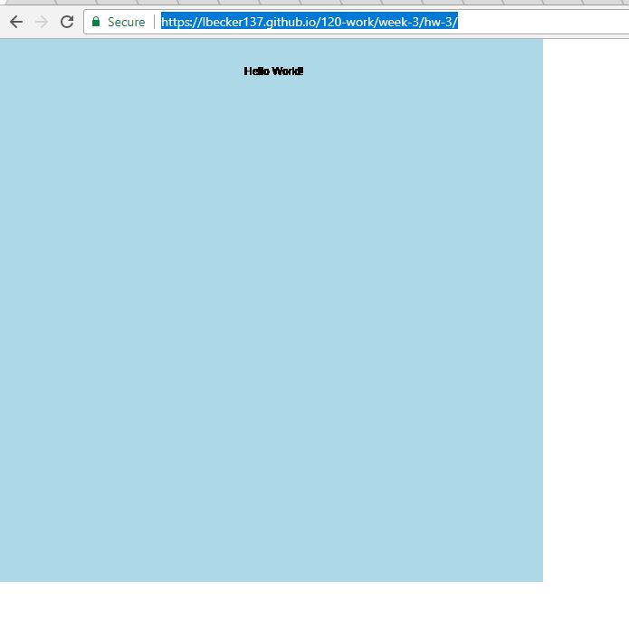

Leah Becker, 51

["Hello World!" Sketch](https://lbecker137.github.io/120-work/week-3/hw-3/)

# Week 3 Response

## This Homework Cycle

I was excited to start this week's material as it was a chance to get into the coding aspect of the class. I have taken classes in javascript and python before, so the "Hello World" assignment was a dip into familiar territory for me. 

In order to help myself memorize the syntax of the code we worked with this week, I typed it out multiple times and re-read much of the material. I've spent the last year using python almost exclusively, so I expect I will make quite a few syntax errors.

## Problems

The problems I ran into this week were mostly user errors. I had a tendency to save files to the wrong location. I also spent a while attempting to access the github page for my homework. My problem was that I had nested folders, but was trying to directly access the hw-3 folder. i.e. I was typing 120-work/hw-3/ at the end of the url when I had put the hw-3 file in a file called week-3. Therefore it was actually 120-work/week-3/hw-3. I was just about to add an issue for it before I figured out my problem.

## hello world screenshot

